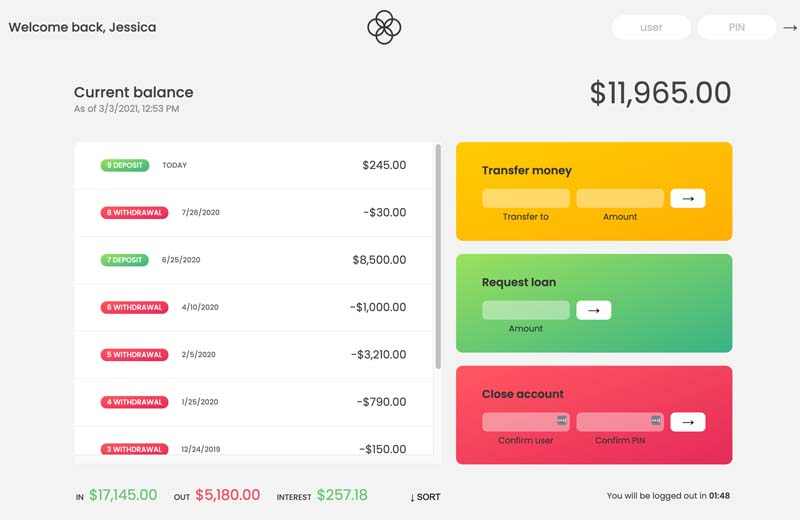

# js-bankist
A vanilla JavaScript banking application. You can login as user1 (js, 1111) or user2 (jd, 2222). After logging in the current user can transfer money to the other user, request a loan amount from the bank or close their account. Money values are displayed based on the user's set locale (using the internationalization api). A user can see a current balance, a list of movements (deposits or withdrawals) the total deposits, total withdrawals and interest earned. There is also a sort feature and a logout timer set to 2 minutes of inactivity.

## How Its Done
DOM manipulation techniques like querySelector, addEventListener, textContent are used to manipulate UI for various inputs and button clicks. Many array methods are used in this app (.sort(), .filter(), .map(), .reduce(), etc...). setTimeout() and clearInterval() are also being used for the logout timer. The forEach() method is being used to loop through the account data for each user when logged in to retreive data.

